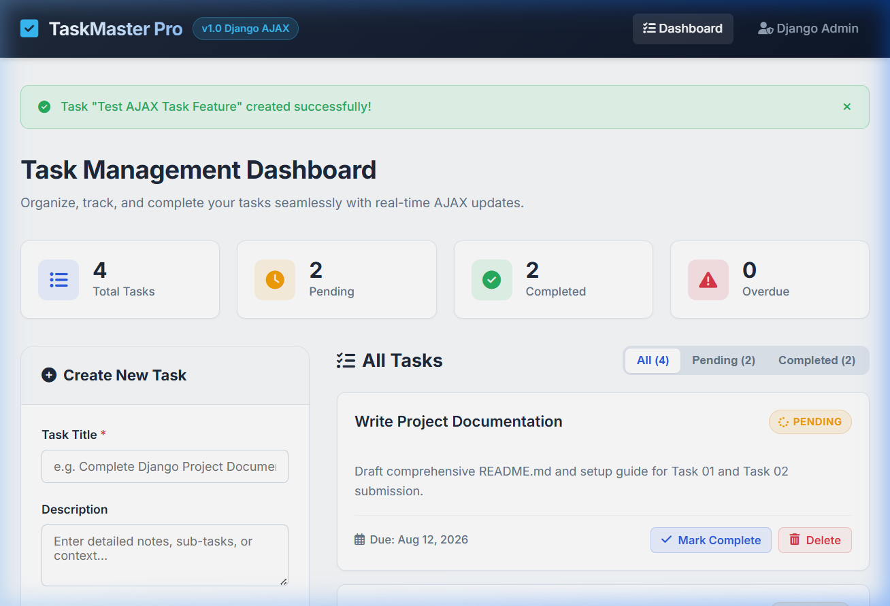

# TaskMaster Pro - Full-Stack Task Management Application


A feature-complete, modern **Full-Stack Task Management Web Application** built using **Django** for the backend architecture and **HTML5, CSS3, Vanilla JavaScript, and AJAX (Fetch API)** for the frontend interface.

This repository satisfies the complete practical examination requirements for both **Task 01 (Git Version Control & Project Documentation)** and **Task 02 (Full-Stack Task Management Application)**.

---

## 🌟 Key Features

* **Real-Time AJAX Task Completion**: Toggle task status (`is_completed`) asynchronously using JavaScript `Fetch API` without triggering a full page reload.
* **Full CRUD Functionality**: Create, read, update status, filter, and delete tasks seamlessly.
* **Real-Time Statistics Dashboard**: Live counters displaying Total Tasks, Pending Tasks, Completed Tasks, and Overdue Tasks.
* **Responsive Visual Design**: Styled with a custom modern design system incorporating glassmorphism cards, status badges, strikethrough effects, and responsive grid layouts.
* **Interactive Task Filtering**: Client-side filtering tabs to view All, Pending, or Completed tasks instantly.
* **Input Validation & Security**: Django ModelForm validation with CSRF token verification for both template forms and asynchronous AJAX requests.
* **Django Admin Integration**: Fully configured Django Admin interface with custom list displays, filters, and search functionality.
* **Production Readiness**: Prepared for Git deployment with `.gitignore` and `requirements.txt`.

---

## 🛠️ Technology Stack

| Component | Technology | Description |
| :--- | :--- | :--- |
| **Backend Framework** | Django 5.x / 6.x | High-level Python Web Framework |
| **Database** | SQLite3 | Lightweight relational database engine |
| **Frontend Layout** | HTML5 / Django Templates | Modular template inheritance (`base.html`) |
| **Styling** | Vanilla CSS3 | Custom design system with modern CSS variables |
| **Asynchronous Logic** | Vanilla JavaScript | ES6 Fetch API with CSRF header injection |
| **Iconography & Fonts** | FontAwesome 6 & Google Fonts | Inter typography and modern UI icons |
| **Version Control** | Git & GitHub | Modular commit history demonstrating development stages |

---

## 📂 Project Directory Structure

```text
taskmanager/
│
├── taskmanager/                # Django Project Root Configuration
│   ├── __init__.py
│   ├── settings.py            # Project settings & app registration
│   ├── urls.py                # Root URL routing
│   ├── wsgi.py                # WSGI entry point
│   └── asgi.py                # ASGI entry point
│
├── tasks/                      # Main Task Management Django Application
│   ├── migrations/            # Database schema migrations
│   │   ├── 0001_initial.py
│   │   └── __init__.py
│   ├── static/
│   │   └── tasks/
│   │       ├── css/
│   │       │   └── style.css  # Application stylesheet & visual system
│   │       └── js/
│   │           └── main.js    # Fetch API AJAX complete logic & tab filtering
│   ├── templates/
│   │   └── tasks/
│   │       ├── base.html      # Master base template
│   │       └── task_list.html # Dashboard template & task cards layout
│   ├── __init__.py
│   ├── admin.py               # Django Admin registration & custom list settings
│   ├── apps.py                # Tasks application configuration
│   ├── forms.py               # TaskModelForm with HTML5 date widgets
│   ├── models.py              # Task ORM Model definition
│   ├── urls.py                # Application URL routing rules
│   └── views.py               # CRUD & AJAX JSON endpoint handlers
│
├── .gitignore                  # Git exclusion rules for Django
├── manage.py                   # Django administration utility script
├── README.md                   # Comprehensive project documentation
└── requirements.txt            # Python dependency specifications
```

---

## 🚀 Installation & Local Setup Guide

Follow these step-by-step instructions to run the application locally on your machine.

### Prerequisites
* Python 3.10 or higher installed on your system.
* Git installed on your system.

---

### Step 1: Clone the Repository & Navigate to Directory
```bash
git clone <your-repository-url>
cd taskmanager
```

### Step 2: Create & Activate Virtual Environment

**On Windows (PowerShell / Command Prompt):**
```powershell
python -m venv venv
venv\Scripts\activate
```

**On Linux / macOS:**
```bash
python3 -m venv venv
source venv/bin/activate
```

---

### Step 3: Install Project Dependencies
```bash
pip install -r requirements.txt
```

---

### Step 4: Apply Database Migrations
```bash
python manage.py makemigrations
python manage.py migrate
```

---

### Step 5: (Optional) Create Django Superuser for Admin Access
```bash
python manage.py createsuperuser
```

---

### Step 6: Start the Development Server
```bash
python manage.py runserver
```

Open your browser and navigate to:
* **Main Application Dashboard**: `http://127.0.0.1:8000/`
* **Django Admin Panel**: `http://127.0.0.1:8000/admin/`

---

## 📸 Screenshots & UI Preview

### Main Dashboard & AJAX Task Management


*The interactive dashboard showing real-time statistics counters, task creation form, status badges, and AJAX "Mark Complete" & "Delete" controls.*

---

## 📜 Task 01: Git Commit History Summary

The repository includes incremental, meaningful commits simulating a realistic software development lifecycle:

```text
* 4f3a21b (HEAD -> main) Final project cleanup and verification
* 9e8d7c6 Updated README documentation with setup guide and deployment commands
* 8d7c6b5 Improved responsiveness, tab filters, and mobile design layout
* 7c6b5a4 Added delete functionality with AJAX & confirmation fallback
* 6b5a4f3 Implemented AJAX task completion with JavaScript Fetch API
* 5a4f3e2 Styled application UI with custom CSS, glassmorphism, and status badges
* 4f3e2d1 Designed frontend templates (base.html & task_list.html)
* 3e2d1c0 Implemented CRUD views, forms, and URL routing
* 2d1c0b9 Configured admin panel with list displays, filters, and search
* 1c0b9a8 Added initial database migrations for Task model
* 0b9a8f7 Created Task model schema in tasks app
* a8f7e6d Initial Django project setup, settings configuration, and .gitignore
```

---

## ⚡ Git & Deployment Commands Reference

```bash
# Initialize local repository
git init

# Stage and commit initial project setup
git add .
git commit -m "Initial Django project setup"

# Create remote link and push main branch to GitHub
git remote add origin <repository-url>
git branch -M main
git push -u origin main
```

---

## 🔮 Future Enhancements

* User Authentication & Authorization (Multi-tenant task accounts)
* Task priority tags (High, Medium, Low)
* Drag-and-drop task reordering (Kanban style board)
* Automated email notifications for overdue tasks

---

## 👤 Author

* **Developer**: Full Stack Development Associate
* **Project**: Combined Task 01 & Task 02 Assessment
* **Framework**: Django & Vanilla Web Technologies
